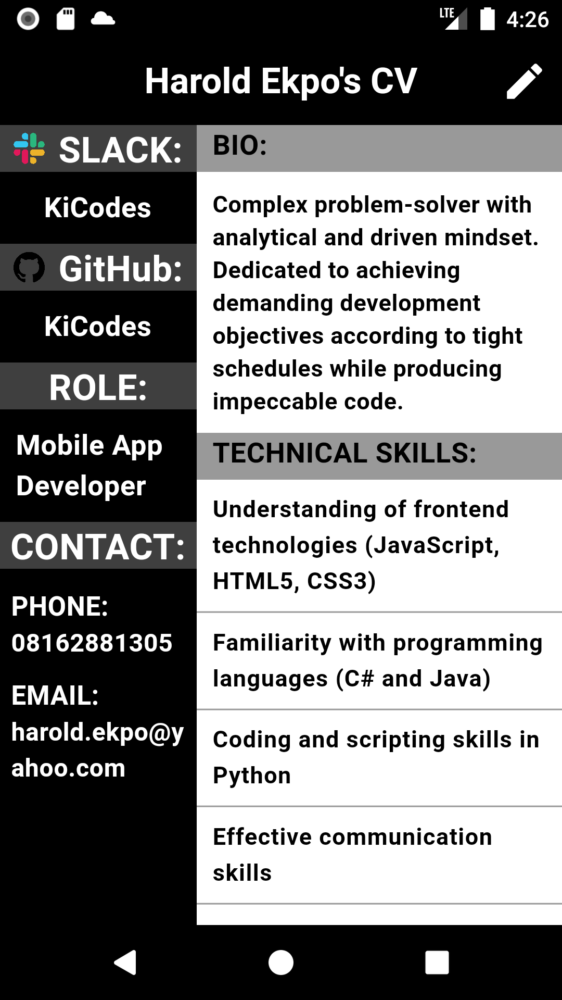
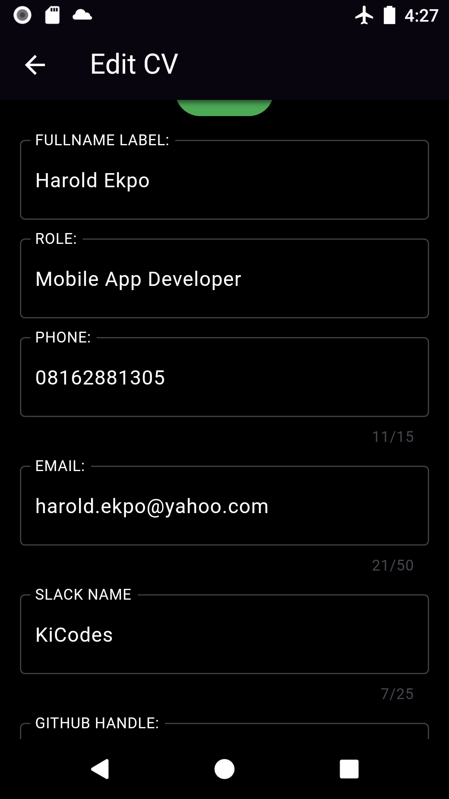

# KiCodes CV App

Welcome to KiCodes_CV, a Flutter-based CV (Curriculum Vitae) editing application. KiCodes_CV is designed to help you create and manage your CV with ease. Whether you're a job seeker, student, or professional, MyCV simplifies the process of creating and maintaining your CV.

## Features

- **User-Friendly Interface:** KiCodes_CV provides an intuitive and user-friendly interface for easy CV creation and editing.

- **Two Pages:** KiCodes_CV consists of two main screens: the Home Screen and the Edit Page.

- **Customizable CV Sections:** You can customize various sections of your CV.

- **Real-Time Editing:** See your CV updates in real-time as you make changes, ensuring that your CV looks exactly the way you want it.


## Screenshots




## Getting Started

Follow these steps to get started with MyCV:

1. **Clone the Repository:**
   ```shell
   git clone https://github.com/KiCodes/KiCodes_CV.git
   cd KiCodes_CV
2. **Install Dependencies:**
   flutter pub get
   
3. **Run the app**
   flutter run

4. **Start Editing**
   Launch the app and navigate to the Edit Page.
   Add your personal details, education, work experience, skills, and any other sections relevant to your CV.
   Save your changes and view your CV on the Home Screen.

